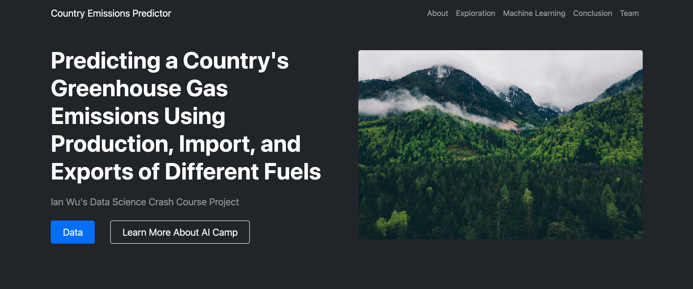
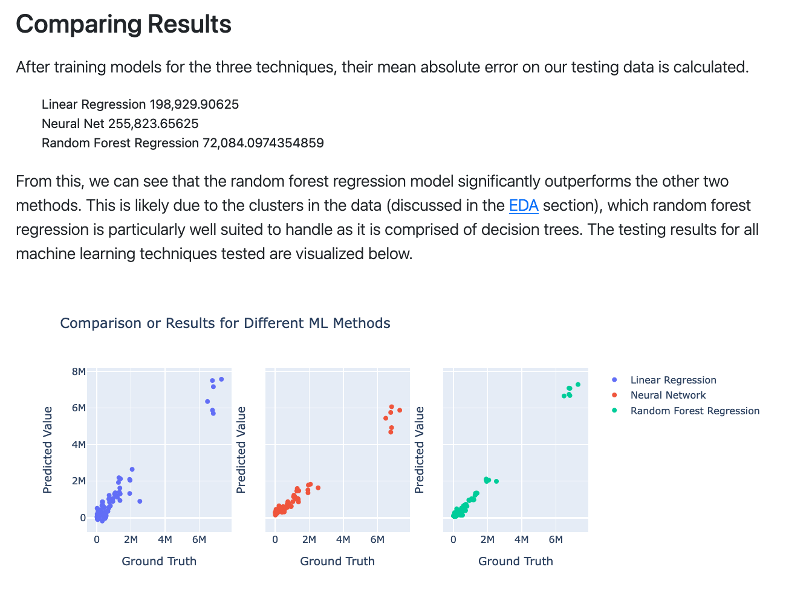

# Info
This is a simple data science study I did as part of onboarding for my data science/machine learning internship at AI Camp. This was one of my earliest data science projects so it holds a special place in my heart, even is it is not particularly sophisticated.

The goal of this project is to predict a country's greenhouse gas emissions using trade and production data for different fossil fuels. The year is also utilized, as technology advancements over time are also an important factor for emission levels. A predictive model could not only be used to estimate the emissions from countries which do not report this data, but could also be used to double check the values for countries that do. In addition, studying the relationship between different fossil fuels is also a valuable exercise, as it is important to understand how different fuels contribute to emissions individually.

The United Nations Statistics Division makes a variety data on UN member countries available online. From their API, we have collected historical yearly data on greenhouse gas emissions and fossil fuel imports, exports, and production for 43 countries aggregated it into a single dataset. Linear regression, neural network, and random forest models were trained using the data, with the random forest regressor achieving the highest accuracy by a significant margin.

Although this project was able to reasonably approximate greenhouse gas emissions with only 9 input features, emission levels are influenced by many variables, as has been extensively researched and proven. By incorporating additional variables to this dataset, an even more accurate model could certainly be achieved. Although we were unable to obtain the data, adding samples from additional countries would likely also strengthen the models.

# Quickstart
To quickly deploy this project, simply navitate to the "app" directory and run "main.py".

```
cd app
python3 main.py
```

# File-structure
Datasets and initial EDA are contained in the `data` directory. 
Machine learning and modeling was conducted in Jupyter Notebooks, which are stored in the `ml` directory
The actual web-app presentation is written flask and stored in the `app` directory.

# App
To present my results I created a simple Flask app using a template. The actual website was built using an HTML/CSS template from [Start Bootstrap](https://startbootstrap.com/).

Instructions to start the app are in the [Quickstart](#quickstart) section above.

# Data
Data was sourced from the [UN Data database](https://data.un.org/) and the original dataset as well as preprocessed version are included in this repository.

Data preprocessing and visualization can be run through the Jupyter notebook at ```data/UN_EDA.ipynb```

# Machine learning
For this project I fit some basic ml models (linear regressor, random forest, neural net). Hyperparameters were minimally cross validated, although I did not include this code (😬 I was a newbie).

The machine learning of this project can be run through the Jupyter notebook at ```ml/Method_Comparison.ipynb```

<p align="center"></p>
